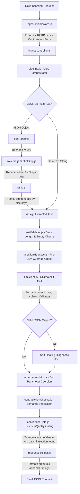

# Customer Triage System - Backend Architecture & AI Decisions

An enterprise-grade, 8-layer customer triage pipeline built to ingest, sanitize, translate, classify, and secure dynamic customer ticket communication payloads.

---

## 1. Backend Folder Architecture

```text
triage-backend/
├── data/                               # Evaluation Datasets
│   ├── dataset.json                    # Standard 40-record customer query dataset
│   ├── dataset_complex.json            # Advanced 40-record dataset (multi-language, HTML, jailbreaks)
│   ├── groundTruth.json                # Expected labels for validation
│   └── groundTruthl.json               # Legacy ground truth mapping
├── eval/                               # Evaluation and Benchmarking
│   ├── metrics.js                      # Calculates precision, recall, F1, and average latency
│   ├── runEval.js                      # Runs evaluation on the standard dataset
│   └── runComplexEval.js               # Runs evaluation on the advanced/complex dataset
├── src/                                # Core Source Code
│   ├── classification/                 # AI & LLM Processing
│   │   ├── fewShotExamples.js          # Predefined inputs/outputs for few-shot learning
│   │   ├── injectionHeuristic.js       # Pre-LLM regex scan for instruction bypass keywords
│   │   ├── llmClient.js                # Ollama integration with corrective self-healing retry logic
│   │   └── promptTemplate.js           # Prompt templates with translation rules and XML boundaries
│   ├── extraction/                     # Input Extraction Layer
│   │   ├── htmlStrip.js                # Custom tag and entity sanitizer
│   │   ├── index.js                    # Ingestion coordinator for text extraction
│   │   ├── rank.js                     # Scores text blocks, penalizing typical system keys
│   │   └── traverse.js                 # Recursive JSON crawler with recursion depth guards
│   ├── ingestion/                      # HTTP Gateway
│   │   ├── ingest.controller.js        # Webhook intake controller
│   │   └── ingest.middleware.js        # Captured rawBody and 100KB stream size limiter
│   ├── output/                         # Response Builder
│   │   └── responseBuilder.js          # Formats output according to the JSON API contract
│   ├── reliability/                    # Verification & Validation Layers
│   │   ├── confidenceGate.js           # Triangulates variables to adjust confidence and route human escalation
│   │   ├── contradictionChecks.js      # Identifies semantic conflicts between category and summary
│   │   ├── fallback.js                 # Safe default templates for system errors
│   │   └── schemaValidator.js          # Zod schema definitions and structural coercion rules
│   └── validation/                     # String Sanitization
│       └── textValidator.js            # Size, encoding, and script verification
├── tests/                              # Automation Test Suite (44 passing tests)
│   ├── classification.test.js          # Asserts LLM wrappers and retry loops
│   ├── extraction.test.js              # Asserts traversers, HTML strip, and node scoring
│   ├── injection.test.js               # Asserts security heuristics and escape detection
│   ├── multilingual.test.js            # Asserts translation of French, Japanese, and Gujarati
│   ├── plainText.test.js               # Asserts plain text input bypass flows
│   └── reliability.test.js             # Asserts confidence gates, Zod coercion, and contradiction checks
├── .env.example                        # Reference environment properties
├── .gitignore                          # Standard gitignore (node_modules, credentials)
├── app.js                              # Express app wiring, CORS, and security headers
├── pipeline.js                         # Core Orchestrator running the 8 triage layers sequentially
└── server.js                           # Node listener startup
```

---

## 2. Architectural Decisions: Why No MVC?

The backend deliberately bypasses the traditional **Model-View-Controller (MVC)** design pattern in favor of a **Pipe-and-Filter (Sequential Pipeline)** architecture for several critical engineering reasons:

1. **No Database Models**: MVC relies heavily on "Models" to represent database schemas and manage state (via ORMs like Sequelize or Mongoose). This triage system is **completely stateless**. It acts as an instant classification engine—taking in a request, processing it, and outputting JSON—without storing data in a persistent local database.
2. **Decoupled View Presentation**: The backend is a pure, headless API. It serves no templates or visual markup (EJS, Pug, HTML). The "View" is completely isolated and handled separately by the React-based client dashboard (`triage-frontend/`).
3. **Pipe-and-Filter Architecture fits the Problem Space**: A triage system is a sequence of transformations: raw stream -> parsed object -> extracted string -> sanitized string -> AI-classified payload -> validated schema -> final response. A linear, 8-layer pipeline orchestrator (`pipeline.js`) is far more cohesive, readable, and debuggable than controller delegation.
4. **Serverless Portability**: Avoiding MVC boilerplate makes this codebase lightweight and modular. It is designed to be easily packaged and deployed as a single, high-performance serverless cloud function (e.g. AWS Lambda or Google Cloud Function).

---

## 3. System Architecture & Data Flow



---

## 4. AI Decisions Note

### A. Model + Tools Used
* **Primary LLM**: `gpt-oss:120b` hosted on the Ollama Cloud service, selected for its balanced multilingual capability, advanced reasoning, and structural syntax compliance.
* **Schema Validation**: **Zod** (`zod` package) serves as our source of truth for runtime typing, ensuring category/priority compliance and enabling automatic fallback defaults.
* **Server Infrastructure**: **Express** with CORS configuration, executing a streaming raw data capture middleware to protect downstream API endpoints from Denial of Service (DoS) attacks.

### B. Prompt Strategy
* **Strict Schema Constraints**: Employs Ollama's native structured format capability (`format: 'json'`) to restrict model output.
* **Payload Isolation**: The user input is wrapped inside explicit, structured XML delimiters:
  ```text
  <<<CUSTOMER_CONTENT_START>>>
  [User Payload]
  <<<CUSTOMER_CONTENT_END>>>
  ```
  This creates a clear boundary between program instructions and untrusted data, making it difficult for adversarial payloads to escape context and hijack system commands.
* **Multilingual Coercion**: Prompt directives explicitly command the model to output the `summary` and `suggested_action` strictly in English, regardless of the language detected inside the payload tags.
* **LLM-Based Language Scalability**: The system does not rely on a static list of pre-configured translation scripts. Instead, it dynamically supports any language native to the underlying `gpt-oss:120b` model (including Spanish, French, Japanese, Gujarati, Chinese, German, Hindi, Arabic, Korean, Russian, Swedish, and others). The triage processing capability scales automatically as the host LLM's language comprehension expands.

### C. How We Handle Uncertainty and Bad Input
* **Graceful Tree Traversal**: The JSON crawler traverses unknown nested object trees. It skips short values and system keys (like UUIDs or timestamps) using length/keyword penalty scoring, selecting only high-value user text.
* **Self-Healing Corrective Retry**: If the LLM returns an invalid JSON string or violates parameter options (e.g. returning an incorrect category), the system does not crash. It automatically creates a diagnostics prompt listing the parser errors and retries the API call once, successfully healing the output in most cases.
* **Multi-Variable Confidence Gating**: Instead of relying solely on the LLM's self-reported confidence, the system triangulates:
  - Suspicious prompt injection keyword scans (caps confidence to `0.30` and forces escalation).
  - Non-ASCII/foreign text blocks (limits confidence to `0.60` due to translation latency).
  - Multi-issue ticket conjunctions (limits confidence to `0.70`).
  If the final calculated confidence falls below `0.75`, the system automatically flags `needs_human: true`.

### D. How We Know It Works (Verification)
* **Complete Automation Coverage**: A test runner executing **44 unit and multilingual integration test cases** via Node's native test module covers every script (parsing, recursion loops, html stripping, regex overrides, Gujarati/French/Japanese translations, and plain text bypass flows).
* **Double Dataset Evaluation**:
  - `dataset.json`: Evaluated against ground truth to confirm precision, recall, and latency metrics.
  - `dataset_complex.json`: 40 complex test cases (highly nested JSON, scripts, and 8 different types of jailbreak/prompt injection attacks) executed via `node eval/runComplexEval.js`. 100% of adversarial jailbreaks are successfully routed to the human reviewer queue.

### E. What We'd Fix with More Time
1. **Token-Level Window Truncation**: Replace simple character-based truncation with BPE token counting (like `tiktoken`) to accurately clip payloads before invoking the LLM, reducing latency and cost.
2. **Dynamic Vector Few-Shot Selection**: Implement a lightweight vector database (or local cosine similarity embeddings search) to retrieve the most contextually relevant few-shot examples dynamically, instead of hardcoding static examples in the prompt.
3. **Multi-Model Consensus Checking**: Add a lightweight, fast local classifier model (like a fine-tuned DistilBERT) to run parallel checks on priority/category, validating output alignment with the primary LLM.

---


